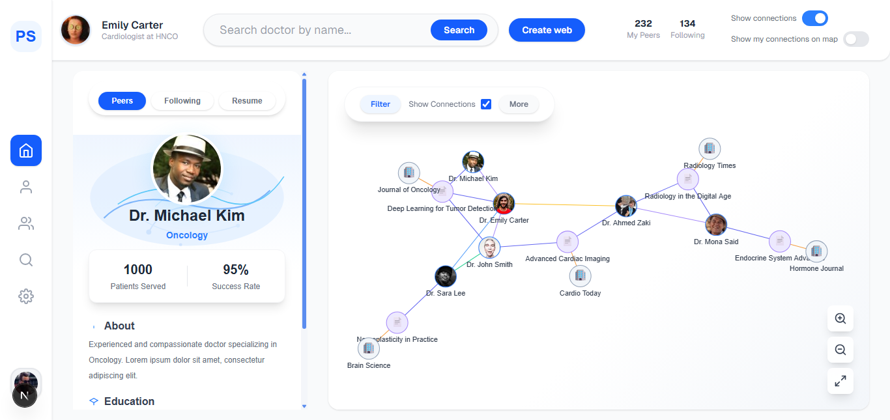

# HCP Network Graph

A modern healthcare professional network visualization app.

**Live Demo:** [hcp-graph.vercel.app](https://hcp-graph.vercel.app)

---

## Why Next.js & Tailwind CSS?
I chose Next.js for its production-grade React features and optimized performance, and Tailwind CSS for rapid, pixel-perfect UI. This ensures a scalable, responsive, and maintainable solution.

---

## Features
- Interactive force-directed graph for HCPs, publications, and publishers.
- Modern sidebar profile card with doctor details and stats.
- Responsive, pixel-perfect UI matching the provided Figma design.
- Filter, search, and focus the graph by name.
- Custom node rendering and smooth animations.
- Built-in filter bar and toggle switches for connections.

---

## Tech Stack
**Next.js**, **React**, **Tailwind CSS**, **react-force-graph**  
Data: Local mock file (`/data/mockGraph.js`)

---

## Getting Started

1. `npm install`
2. `npm run dev`
3. Open [http://localhost:3000](http://localhost:3000)

---

**Author:** [Islam Abdelzaher](https://islamz.me)  
**Live:** [hcp-graph.vercel.app](https://hcp-graph.vercel.app)
